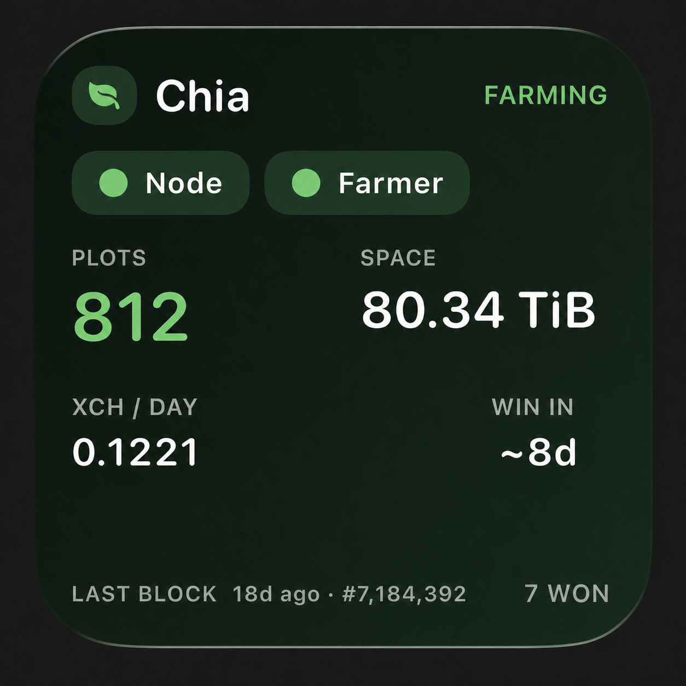
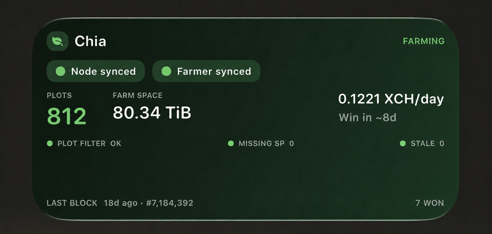

# Chia Monitor

A lightweight Windows agent plus one iPhone Scriptable widget. Open your phone and see within seconds whether the Chia farm is healthy.

## Widget preview

<table>
  <tr>
    <td align="center" width="34%">
      <strong>Small</strong><br><br>
      
    </td>
    <td align="center" width="66%">
      <strong>Medium</strong><br><br>
      
    </td>
  </tr>
</table>

## What the widget shows

- Clear farming status plus farmer and node sync
- Plot count and farm size
- Plot filter, missing signage points and stale partials
- Estimated time to win and estimated XCH per day
- Blocks won and when the last block was won
- Cached data when the miner cannot be reached
- Local iPhone notifications for new farm alerts

The agent also checks failed plots, disk availability, and free space.

Estimated daily XCH is a statistical projection based on current farm size, network space, and the Chia block reward at the current height. It is not guaranteed income and does not subtract pool fees.

## Install on the Windows miner

Requirements:

- 64-bit Windows with Chia farming services running
- Chia's default mainnet data directory at `C:\Users\YOUR_NAME\.chia\mainnet`
- Tailscale on the Windows miner and iPhone for private remote access

Open **PowerShell as Administrator** and run:

```powershell
Set-ExecutionPolicy -Scope Process Bypass
irm https://raw.githubusercontent.com/diepei/chia-monitor/main/install-windows.ps1 | iex
```

The installer downloads the Windows agent, verifies its SHA-256 checksum, creates a random API token, and registers the agent in Windows Task Scheduler.

The configuration is stored at:

```text
%LOCALAPPDATA%\ChiaMonitor\config.yaml
```

Edit it to add farm drives:

```yaml
disks:
  - name: "Farm 01"
    mountpoint: "D:\\"
    device: "\\\\.\\PhysicalDrive1"
```

`device` is optional. For disk temperature and SMART health, install smartmontools and confirm `smartctl.exe` exists under `C:\Program Files\smartmontools\bin`. Drive availability and capacity work without it.

### RPC troubleshooting

RPC failures and their original exceptions are written to:

```text
%LOCALAPPDATA%\ChiaMonitor\chia-monitor.log
```

For temporary request/response diagnostics, add `rpc_debug: true` to `config.yaml` and restart the **Chia Monitor Agent** scheduled task. Return it to `false` after troubleshooting; response previews can include plot paths and wallet addresses, but never API tokens or private keys.

The agent automatically learns plot count, farm size and harvester count after five healthy readings. It stores this non-secret baseline in `%LOCALAPPDATA%\ChiaMonitor\state.json`, warns when capacity drops, and automatically accepts stable increases. After intentionally removing capacity, reset the learned baseline with:

```powershell
& "$env:LOCALAPPDATA\ChiaMonitor\chia-monitor.exe" --reset-baseline --config "$env:LOCALAPPDATA\ChiaMonitor\config.yaml"
Stop-ScheduledTask -TaskName "Chia Monitor Agent"
Start-ScheduledTask -TaskName "Chia Monitor Agent"
```

## Connect privately with Tailscale

Never port-forward the monitor or any Chia RPC port.

After signing the PC and iPhone into the same tailnet, run in Administrator PowerShell:

```powershell
tailscale serve --bg localhost:8926
tailscale serve status
```

Use the displayed `https://...ts.net` address in Scriptable. Tailscale terminates HTTPS and forwards requests only inside your tailnet to the agent on `127.0.0.1:8926`. See the official [Tailscale Serve documentation](https://tailscale.com/docs/reference/tailscale-cli/serve).

## Install the iPhone widget

Follow [scriptable/README.md](scriptable/README.md). You need:

- The Tailscale HTTPS address
- The `api_token` from `%LOCALAPPDATA%\ChiaMonitor\config.yaml`

## Security

- Chia RPC stays bound to localhost and is never exposed.
- The agent uses Chia's local TLS certificates read-only.
- No seed phrase, private wallet key, or RPC certificate is returned.
- `/api/widget` requires a bearer token.
- `/healthz` reveals only that the process is alive.
- There are no send-XCH, plotting, key-management, or start/stop endpoints.
